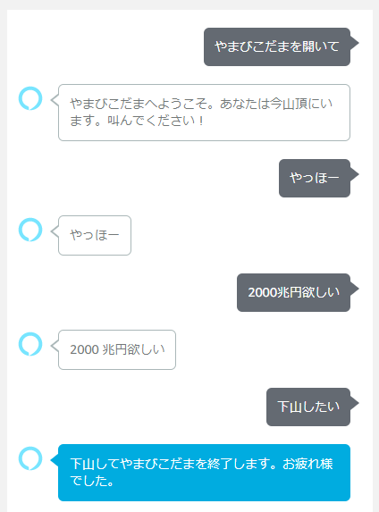

# やまびこだま

Alexaが話しかけられたことを復唱してくれるスキルです。

山頂に来た気持ちになって叫んでみて下さい。

# DEMO
近日公開予定。

<!--

-->

# Features

山頂に来た気持ちになれます。

実質リモート登山です。

# Requirement

* ASK SDK v2 for Node.js

# Installation

[Alexa Developer Console](https://developer.amazon.com/alexa/console/ask) 上で[gitリポジトリを指定してスキルを作成](https://developer.amazon.com/ja-JP/docs/alexa/hosted-skills/alexa-hosted-skills-git-import.html)すれば使用できます。

# Usage

「アレクサ、やまびこだまを開いて」で開始。

以降は話しかけた言葉をAlexaが復唱してくれます。

終了したい場合はAlexaに「下山したい」と話しかけて下さい。

# Author

* けいとだま
* Twitter : https://twitter.com/keitEngineer

# License

Copyright (c) 2020 KeitoDama

"やまびこだま" is under [MIT license](https://en.wikipedia.org/wiki/MIT_License).